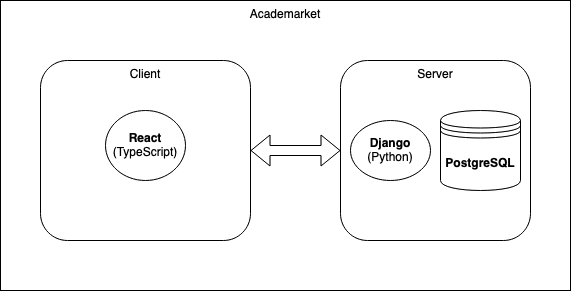

# Academarket :monkey: 
A fantasy trading platform that aims to provide users with a simulated stock trading experience based on courses offered by LIU. Users will be able to create accounts, receive an initial virtual currency allocation, invest in virtual stocks representing courses, track their portfolio performance, and engage in simulated trading activities. The stocks will change in value depending on students results on exams, etc.

## Initial Goals
- Display charts for courses
- Account management
- Investing and portfolio management

## Future Developments
- Provide information about each course and its available data
- Potential improvements of stock value algorithm
- Implement social feautures: leaderboards, comments, messaging, discussions page, etc. 
- Add trading features: limit buy/sell, stop-loss, leverage trading, etc. 

## Technical specifications:
- Frontend:
    - React: A JavaScript library for building user interfaces.
    - TypeScript: A statically typed superset of JavaScript that compiles to plain JavaScript.
    - HTML/CSS: Markup and styling for the frontend components.
- Backend:
    - Django: A high-level Python web framework for rapid development and clean, pragmatic design.
    - Django REST Framework: A powerful toolkit for building Web APIs in Django.
    - Python: Backend logic and server-side scripting.
- Database:
    - PostgreSQL: An open-source relational database management system known for its reliability and robustness.
- API:
    - Charting APIs: Integrate APIs for charting and visualization to provide users with interactive graphs and analytics. (Probably TradingView Lightweight Charts)
    - LIU Course API: Potentially fetching data from https://ysektionen.se/student/tentastatistik/
- Authentication:
    - Django's built-in authentication system or something else. 

